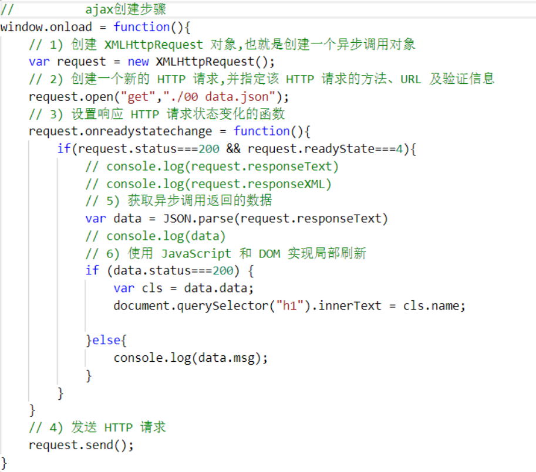

# Ajax
## Ajax是什么？如何创建一个Ajax?
### **(1) 含义**
* ajax 的全称：Asynchronous Javascript And XML。异步传输+js+xml。所谓异步，在这里
简单地解释就是：向服务器发送请求的时候，我们不必等待结果，而是可以同时做其他的事情，等到有了结果它自己会根据设定进行后续操作，与此同时，页面是不会发生整页刷新的，提高了用户体验。  
### **(2) 创建步骤**
1. 创建 XMLHttpRequest对象，也就是创建一个异步调用对象。
2. 创建一个新的HTTP请求，并指定该HTTP请求的方法（GET,POST等）、URL以及验证信息
3. 设置相应HTTP请求状态变化的函数
4. 发送HTTP请求
5. 获取异步调用返回的数据
6. 实用JavaScript和DOM实现局部刷新
### **(3) 如下图所示：**
